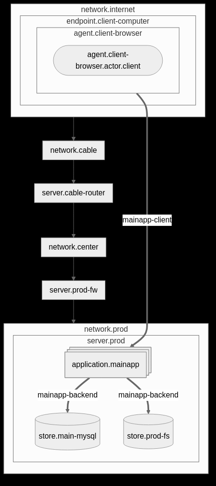

# Taconic Security Model

This project provides a data model for describing the security
relevant features of Information Technology systems, and tools for
generating diagrams and reports from those models.  It is intended to
be used for security architecture, auditing, and compliance tasks.

The project is Rust workspace containing the following crates:

* secmodel -- a CLI frontend
* secmodel_core -- a library providing the domain model
* secmodel_md -- library for generating markdown reports
* sedmodel_mermaid -- library for generating Mermaid diagrams

The model is defined in a [TOML File](example/webapp/security_model.toml) and an be processed with the `secmodel` CLI to produce an [Overview Diagram](example/webapp/overview.png) and a [Security Architecture Report](example/webapp/report.md) ([(pdf)](example/webapp/report.pdf)

Here is an example model of a simplified web app



# Usage

To produce a security architecture report:
```sh
cargo run -- -m mymodel.toml report > report.md
```

Subsequently, you can use the mermaid CLI,`mmdc`, and `pandoc` to
generate a PDF.

```sh
mmdc -i report.md -e pdf -o out.md && pandoc --toc out.md -o report.pdf
```

To create just the overview diagram:

```sh
cargo run -- -m mymodel.toml diagram > diagram.m
```

That can be processes with the mermaid CLI into an svg,  this will produce a `diagram.m.svg` in the current directory:

```sh
mmdc -i diagram.m -b black
```


