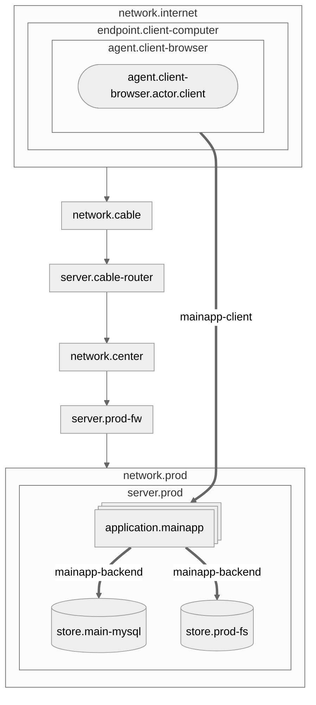

---
title: Security Architecture Model
author: Taconic System
header-includes: |
    \usepackage{fancyhdr}
    \pagestyle{fancy}
    \fancyhead[CO,CE]{Security Architecture Model}
    \fancyfoot[CO,CE]{Taconic Systems}
    \fancyfoot[LE,RO]{\thepage}
---

# Overview

# Entities

## Networks

### Internet {#network.internet}

The public internet

Connected Endpoints:

* [Client Computer](#endpoint.client-computer)

----

### Comcast Network {#network.cable}

The 

Peer Networks:

* [Internet](#network.internet)

Connected Servers:

* [Comcast Router](#server.cable-router)

----

### Center Street {#network.center}

Main office network.

Connected Servers:

* [Comcast Router](#server.cable-router)
* [Production Firewall](#server.prod-fw)

----

### Production {#network.prod}

Production Network

Connected Servers:

* [Production Firewall](#server.prod-fw)
* [Production](#server.prod)

----

## Servers

### Comcast Router {#server.cable-router}

* Owner: cable

Network Interfaces:

*  Network: [Center Street](#network.center) Address: 20.70.122.13
*  Network: [Comcast Network](#network.cable) Address: 83.153.3.143

----

### Production Firewall {#server.prod-fw}

* OS: linux
* Version: ubuntu 20

Network Interfaces:

*  Network: [Center Street](#network.center) Address: 20.70.122.14
*  Network: [Production](#network.prod) Address: 192.168.1.1

----

### Production {#server.prod}

* OS: linux
* Version: ubuntu 20

Network Interfaces:

*  Network: [Production](#network.prod)

Hosted Applications:

* [PHP WebApp](#application.mainapp)

Hosted Stores:

* [Production MySQL](#store.main-mysql)
* [Production Filesystem](#store.prod-fs)

----

## Endpoints

### Client Computer {#endpoint.client-computer}

A client's computer

Network Interfaces:

*  Network: [Internet](#network.internet)

Hosted Agents:

* agent.client-ssh
* [Client Browser](#agent.client-browser)

----

## Applications

### PHP WebApp {#application.mainapp}

A multi-tenant Application instance

Connected Flows:

* [PHP WebApp Backend](#flow.mainapp-backend)
* [flow.mainapp-client](#flow.mainapp-client)

----

## Actors

### Client {#actor.client}

A client

----

## Agents

### Client Browser {#agent.client-browser}

Clients using a web browser on their computer.

* Actor: [Client](#actor.client)
* Process: process.web-browser

Connected Flows:

* [flow.mainapp-client](#flow.mainapp-client)

----

## Flows

### PHP WebApp Backend {#flow.mainapp-backend}

Sources:

* [PHP WebApp](#application.mainapp)

Destinations:

* [Production Filesystem](#store.prod-fs)
* [Production MySQL](#store.main-mysql)

Data:

* [Health Information](#data.health-info)
* [Login Credentials](#data.login-credentials)

----

### flow.mainapp-client {#flow.mainapp-client}

* Channel: [channel.https](#channel.https)

Sources:

* [Client Browser](#agent.client-browser)

Destinations:

* [PHP WebApp](#application.mainapp)

Data:

* [Login Credentials](#data.login-credentials)
* [Health Information](#data.health-info)

----

## Channels

### channel.ipv4 {#channel.ipv4}

Protocols:

* protocol.ipv4

----

### channel.ipv6 {#channel.ipv6}

Protocols:

* protocol.ipv4

----

### channel.ip {#channel.ip}

Protocols:

* protocol.ipv4
* protocol.ipv6

----

### channel.tcp {#channel.tcp}

Protocols:

* protocol.ipv4
* protocol.ipv6

----

### channel.ssh-keypair {#channel.ssh-keypair}

* Authentication: authentication.ssh-keypair
* Encryption: encryption.ssh-ciphers
* Ports: 22

Protocols:

* protocol.ssh

Runs on Channels::

* [channel.ipv4](#channel.ipv4)

----

### channel.wpa2-wifi {#channel.wpa2-wifi}

* Authentication: authentication.wpa2
* Encryption: encryption.wifi

Protocols:

* protocol.wifi

----

### channel.https {#channel.https}

* Encryption: encryption.tls
* Ports: 443

Protocols:

* protocol.https

Hosted Flows:

* [flow.mainapp-client](#flow.mainapp-client)

----

## Data Types

### Login Credentials {#data.login-credentials}

Passwords used by clients and employees to login to main app

* Classification: classification.confidential

Data Flows:

* [PHP WebApp Backend](#flow.mainapp-backend)
* [flow.mainapp-client](#flow.mainapp-client)

Data Stores:

* [Production MySQL](#store.main-mysql)

----

### Health Information {#data.health-info}

* Classification: classification.high-risk

Regulations:

* regulation.phi
* regulation.pii

Data Flows:

* [PHP WebApp Backend](#flow.mainapp-backend)
* [flow.mainapp-client](#flow.mainapp-client)

Data Stores:

* [Production MySQL](#store.main-mysql)
* [Production Filesystem](#store.prod-fs)

----

### Health Metadata {#data.health-metadata}

* Classification: classification.sensitive

Data Stores:

* [Production MySQL](#store.main-mysql)

----

## Data Stores

### Production MySQL {#store.main-mysql}

* Backing Store: [Production Filesystem](#store.prod-fs)

Data:

* [Health Information](#data.health-info)
* [Login Credentials](#data.login-credentials)
* [Health Metadata](#data.health-metadata)

Connected Flows:

* [PHP WebApp Backend](#flow.mainapp-backend)

----

### Production Filesystem {#store.prod-fs}

Data:

* [Health Information](#data.health-info)

Connected Flows:

* [PHP WebApp Backend](#flow.mainapp-backend)

----

## Risks

### IPv6 Protocol enabled, but not managed {#risk.ipv6-unmanaged}

----

### Credential Stuffing {#risk.credential-stuffing}

Attackers can try common passwords, or passwords associated with user from other leaks to attempt to login.  This can be mitigated thru several means:

Mitigations:

* Require Multi-Factor Auth
* Require authenticated network access via VPN
* Limit access to login to client IPs (by ASN or CIDR)
* Use SSL Client certificates for client (a form of MFA)

----

### Pre-Auth Vulnerabilities {#risk.pre-auth-attack-surface}

Attackers can access or manipulate data without authenticating due to vulnerabilities in the application authentication logic, or system configuration.

* Use SSL Client certificates for client (a form of MFA)
* Require authenticated network access via VPN
* Limit access to login to client or employee IPs (by ASN or CIDR)

----

### Unmanaged Device {#risk.unmanaged-device}

A device or computer that a user is using to access the system is unamanaged.  This leads to inconsistent, or unknown security posture, reduced observabiilty, and potential for exploitation.

----

### Unmanaged Device {#risk.vulnerable-software}

A device or computer that a user is using to access the system is unamanaged.  This leads to inconsistent, or unknown security posture, reduced observabiilty, and potential for exploitation.

----

### Unauthenticated Service {#risk.unauthenticated-service}

A service is listening on a network which does not require credentials, and presumes that network access is a sufficient control.

----

### No remote Backup {#risk.no-remote-backup}

The store has no offsite backup policy, or validated offsite backup.

----

### No Backup {#risk.no-backup}

The store has no backup policy, or validated backup.

----

### Third Party Control {#risk.third-party-control}

The resource is owned and operated by a third-party, which managed updates

----

### Inconsistent Updates {#risk.inconsistent-updates}

The resource does not receive consistent updates, which can result in unpatched vulnerabilities.

Mitigation:
* establish a automated, or scheduled update process

----

### Unaudited Controls {#risk.unaudited-controls}

A security control should have regular audits to ensure that it is effective and behaving as expected.

----

## Regulations

### HIPAA Protected Health Information {#regulation.hipaa-phi}

Protected health information (PHI) under U.S. law is any information about health status, provision of health care, or payment for health care that is created or collected by a Covered Entity (or a Business Associate of a Covered Entity), and can be linked to a specific individual. This is interpreted rather broadly and includes any part of a patient's medical record or payment history.

Under the U.S. Health Insurance Portability and Accountability Act (HIPAA), PHI that is linked based on the following list of 18 identifiers must be treated with special care:

- Names
- All geographical identifiers smaller than a state, except for the initial three digits of a zip code if, according to the current publicly available data from the U.S. Bureau of the Census: the geographic unit formed by combining all zip codes with the same three initial digits contains more than 20,000 people; the initial three digits of a zip code for all such geographic units containing 20,000 or fewer people is changed to 000
- Dates (other than year) directly related to an individual
- Phone Numbers
- Fax numbers
- Email
- Social Security numbers
- Medical record numbers
- Health insurance beneficiary numbers
- Account numbers
- Certificate/license numbers
- Vehicle identifiers and serial numbers, including license plate numbers;
- Device identifiers and serial numbers;
- Web Uniform Resource Locators (URLs)
- Internet Protocol (IP) address numbers
- Biometric identifiers, including finger, retinal and voice prints
- Full face photographic images and any comparable images
- Any other unique identifying number, characteristic, or code except the unique code assigned by the investigator to code the data

----

### HIPAA Security Rule {#regulation.hipaa-security-rule}

HIPAA Security Rule Details: <https://www.ecfr.gov/current/title-45/part-164/subpart-C>

Written forms of the following policies are required

Security Rule Requirements:

* Security Management Process
  * Risk Analysis (Required)
  * Risk Management (Required)
  * Sanction Policy (Required)
  * Information System Activity Review (Required)
* Assigned Security Responsibility 
* Workforce Security
  * Authorization/Supervision Procedure
  * Workforce Clearance Procedure
  * Termination Procedure
* Information Access
  * Isolation of Funcion (Required)
  * Access Authorization/Review Process
* Security Awareness Training
  * Periodic Reminders/Updates for workforce
  * malware protection (AV/EDR)
  * log-in monitoring (workstation, applications)
  * credential management
* Incident Response Policy  
* Contigency Plan (Required)
  * Data Backup Plan (Required)
  * Disaster Recovery Plan (Required)
  * Emergency Mode Plan (Required)

* Physical Safeguards
  * Facilities Access Control Policy
* Workstation Security
  * Password Required
  * Media Re-Use and Disposal Policy
  * Backup Policy

* Access Control
  * Unique User Identifiers
  * Emergency Access
  * Automatic Logoff
  * Encryption
    * Transmission
    * At Rest/Storage
* Audit Controls
  * Offhost audit logs
  

These policies must be written, and stored in compliance with:
<https://www.ecfr.gov/current/title-45/section-164.316>

A convenient Security Standards Matrix is here:
<https://www.ecfr.gov/current/title-45/part-164/appendix-Appendix A to Subpart C of Part 164>

----

